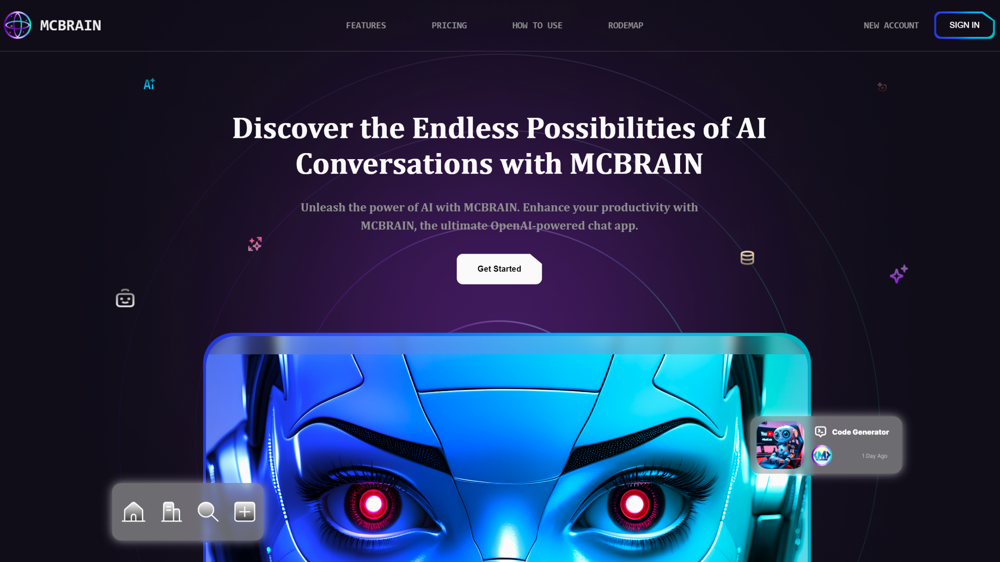

---
## Introduction: 
#### 🔥 Build an AI Landing Page with HTML, CSS & JavaScript | Modern UI, Animations & Parallax Effects!

#### 🚀 Want to create a stunning AI-powered landing page? In this full tutorial, I'll show you step by step how to build a super modern, fully responsive AI landing page using HTML, Tailwind CSS, and JavaScript—no frameworks required!

#### What You’ll Learn:
#### ✅ Border Gradient Animation for a futuristic look
#### ✅ Parallax Background Effect on mouse movement
#### ✅ Smooth Animations & Transitions for an engaging UI
#### ✅ Interactive Sign-up Page that opens/closes with a smooth effect
#### ✅ Custom Hover Effects & Button Animations
#### ✅ Optimized for Performance & SEO

#### This tutorial is perfect for beginners & advanced developers who want to build eye-catching, interactive websites. Whether you're designing a startup, an AI product, or just want to level up your web skills—this video is for you! 🎯

---
## Watch the full tutorial on YouTub
